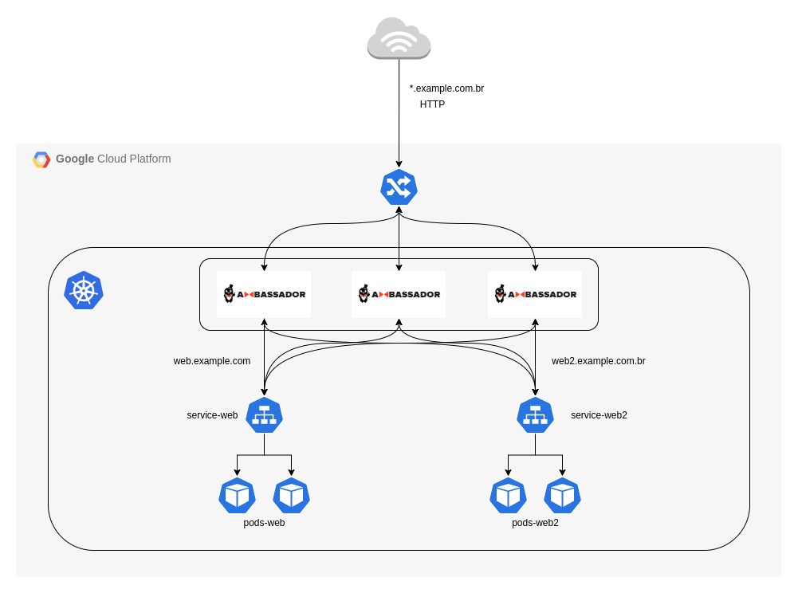

# ambassador-getstarted

[Install with Google Kubernetes Engine (GKE) Ingress](https://www.getambassador.io/docs/latest/topics/running/ambassador-with-gke/)

## Ambassador Architecture 



## How to run?

This steps assumption that you already have an Kubernetes Engine (GKE) running :)

Replace all references `example.com` to `your.domain.com`

#### 1 - Install Ambassador. [Reference](https://www.getambassador.io/docs/latest/topics/install/install-ambassador-oss/#1-deploying-the-ambassador-api-gateway)

```
# CLUSTER-ADMIN ROLES
kubectl create clusterrolebinding my-cluster-admin-binding --clusterrole=cluster-admin --user=$(gcloud info --format="value(config.account)")

# DEPLOY CRDs
kubectl apply -f yamls/1_ambassador-crds.yaml

# DEPLOY RBAC with SERVICE (NodePort)
kubectl apply -f yaml/2_ambassador-rbac.yaml
```

#### 2 - Create Ingress. [Reference](https://cloud.google.com/kubernetes-engine/docs/tutorials/http-balancer)

```
# CREATE STATIC IP
gcloud compute addresses create ambassador-address --global

# CREATE INGRESS
kubectl apply -f yamls/3_ambassador-ingress.yaml
```

#### 3 - Deploy Web

```
kubectl apply -f yamls/4_web.yaml
```

PS: After that you can acess web service in: `http://web.example.com`

#### 4 - Deploy Web v2

```
kubectl apply -f yamls/5_web2.yaml
```

Now you have 2 applications running and ambassador controlling trafic based Host Header :tada: 

#### 99 - HTTP -> HTTPS

Install Cert Manager following [this](https://www.getambassador.io/docs/latest/howtos/cert-manager/) or [this](https://cert-manager.io/docs/installation/kubernetes/) tutorial, to create and manage your certificates in Kubernetes.

```
kubectl apply -f yamls/98_cert-manager.yaml
kubectl apply -f yamls/99_example-com.yaml
```

Update `Host` in the file `yaml/2_ambassador-rbac.yaml` to accept [HTTPS](https://www.getambassador.io/docs/latest/topics/running/host-crd/#the-host-crd-acme-support-and-external-load-balancer-configuration) traffic.
